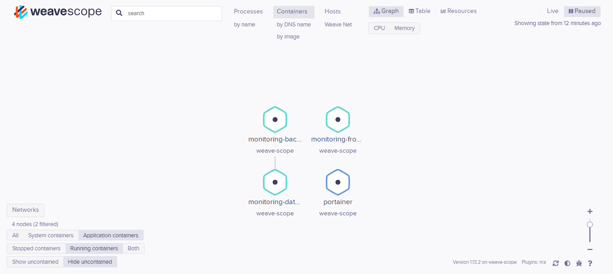
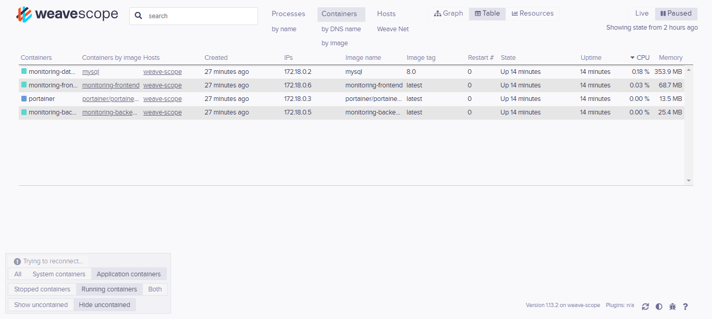

# Projet MicroServices


## Composants techniques de base (4 points)

 - ✅ Votre projet contient un frontend avec au minimum deux routes.
 - ✅ Votre projet contient un backend avec une base de données dans un conteneur spécifique. Vous expliquerez le choix de votre technologie de base de données (relationnelles ou non relationnelles).
 - ✅ Votre base de données est fonctionnelle et composée d’au moins une table/collection ainsi qu’un schéma explicite.
 - ✅ Votre projet contient au moins 2 Dockerfiles et un fichier `docker-compose.yml`.
 - ✅ Votre projet contient un réseau Docker.
 - ✅ Vous avez poussé au moins 2 images Docker sur un registre de conteneurs (type Docker Hub).
 ```bash
docker push dada919/blog_frontend:latest
docker push dada919/blog_backend:latest
docker push dada919/blog_database:latest
```
 - ✅ Votre projet est accessible en ligne publiquement sur un gestionnaire de version (type GitHub, Bitbucket, GitLab…). 


 ## Architecture & Clean Code (2 points)

- ✅ Vous avez schématisé l’architecture de votre projet sous format vectoriel (draw.io ou autre web tools) avec notamment :
  - ✅ Les différents composants/services de votre application.
  
  - ✅ Liens entre ces différents composants/services : protocoles et requêtes types (POST, GET,… en curl/json format).
  - ✅ Les ports exposés sont mis en valeur (côté client et côté backend).
- ✅ Votre README.md à la racine de votre GitHub contient les explications nécessaires pour build et run votre projet ainsi que des screenshots de vos fonctionnalités ainsi que des critères demandés.

- [Voir le README du projet](./Monitoring/README.md)


## Déploiement & Production (4 points)

- ❌ Votre projet dispose d’un service de reverse proxy type Nginx ou Traefik.
- ❌ Vous avez mis en place SSL et HTTPS avec des certificats Let’s Encrypt.
- ✅ Votre projet dispose d’une documentation (auto-générée, vous le voulez, type OpenAPI/formerly Swagger Specification) documentant les différents endpoints/fonctionnalités importantes du projet.
- **URL d'accès** : [Swagger](http://localhost:3001/api-docs/)
- ✅ Vous avez assuré le monitoring en temps réel de vos conteneurs et pouvez partager un dashboard de monitoring via une URL externe (Grafana, Prometheus, Weave Scope…).
- ❌ Votre solution dispose d’un système de gestion de files d’attente ou de push notifications.



## Tests (4 points)

- Vous avez au minimum des tests de conteneurs (bash ou healthcheck) qui :
  - ✅ Testent la santé de vos conteneurs.
  - ✅ Testent le ping de vos applications (frontend / backend).
  - ✅ Testent le bon fonctionnement de votre base de données.
- ✅ Vous avez testé unitairement au minimum 2 composants de votre code base.
- ❌ Vous avez mis en place des tests de montée en charge simples de vos services.
- ✅ Vous avez un parcours de test end-to-end.
- [Voir le README Cypress](./Cypress/README.md)


## Continuous Integration/Deployment with GitHub (4 points)

- ✅ Vous avez au minimum 2 branches (main et dev) pour organiser votre travail et tester vos workflows sur les événements de pull request, push et merge.
- ❌ Vous avez testé vos GitHub workflows en local avec l’outil `act` (screenshot à l'appui).
- ✅ Vous avez mis en place les GitHub workflows suivants dans votre projet :
  - Run and test your frontend server.
  - Run and test your backend server.
  - Build docker image for your backend server.
  - Build docker image for your frontend server.
  - Publish the docker image of your frontend and backend on your public Docker Hub repository.
  - Add build button (to be more professional).
- ❌ Vous avez automatisé votre déploiement sur un cloud server type Cloudron/Coolify, mettez un screenshot dans votre documentation.
